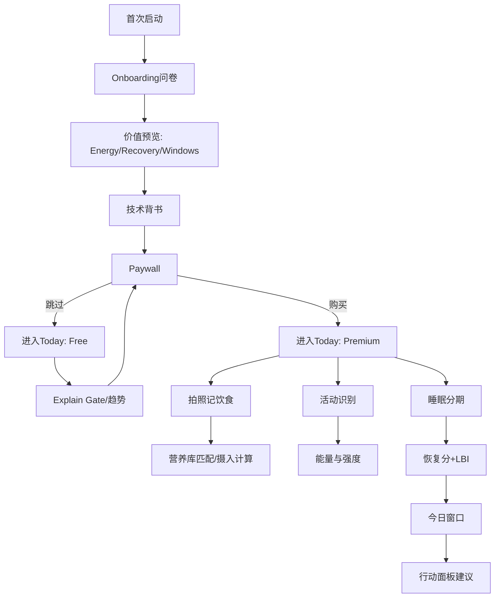

# 02-信息架构与关键用户流

更新时间：2026-01-30

## IA（信息架构）
- Today：Energy / Recovery / Windows / Action Panel
- Food：拍照记录 / 条码录入 / 历史与统计
- Activity：自动识别概览 + 手动抗阻/瑜伽
- Sleep：分期 + 恢复解释 + 趋势
- Settings：账号、订阅、隐私、语言、恢复购买

## 关键用户流

## 设计原则（Oura 风）
- 先给“结果卡片”（Energy/Recovery/Windows），再给“解释层”
- 重要指标可视化：趋势优先、文字克制、避免营销味
