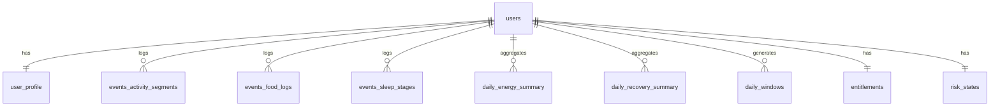

# 01-数据模型与表结构（Postgres）

更新时间：2026-01-30

## 核心表（MVP）
- users / user_profile
- events_activity_segments / events_food_logs / events_sleep_stages
- daily_energy_summary / daily_recovery_summary / daily_windows
- entitlements / risk_states / analytics_events (optional)

