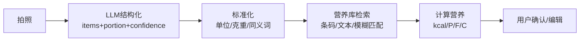

# 04-饮食识别结构化与营养库匹配

更新时间：2026-01-30

## 输出 JSON（统一）
- items: {name, amount, unit, grams_est, confidence}
- totals: {kcal, protein_g, fat_g, carbs_g}
- evidence: {model, latency_ms, cost_est}

## 匹配优先级
1) 条码 → Nutrition DB
2) 文本/照片结构化 → DB 模糊匹配
3) 未命中 → 近似食品 + 强提示确认
