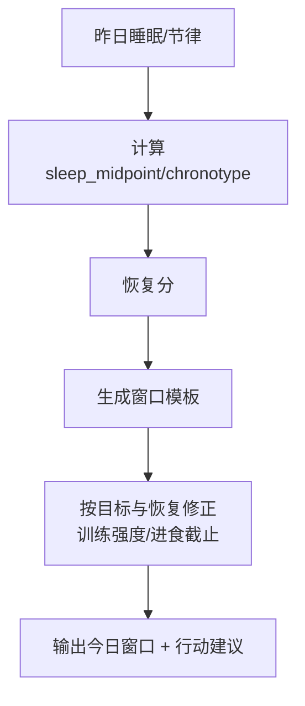

# 07-节律窗口生成算法（Windows）

更新时间：2026-01-30

## 输出窗口（示例）
- light_window: wake+0~2h
- focus_window: wake+2~5h
- dip_window: wake+6~8h
- training_window: 按 recovery 调整
- eating_cutoff: bedtime-3h
- winddown: bedtime-90min~bedtime
