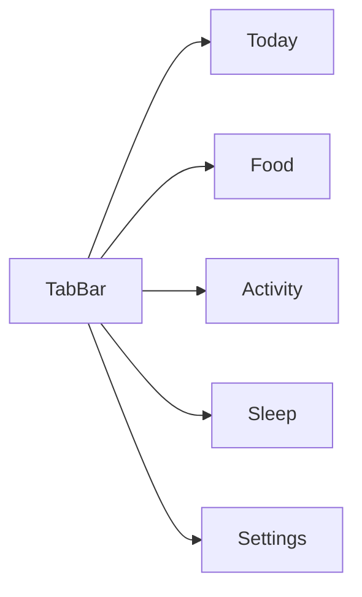

# 01-导航与全局布局（Oura 风）

更新时间：2026-01-30

目标：让用户一眼理解“今天该做什么”，布局克制、信息密度可控、用卡片分层建立信任。

## 全局导航（MVP）
Tab：Today / Food / Activity / Sleep / Settings

## 全局布局
- 顶部：日期 + 简短状态（可选）
- 主体：三张指标卡（Energy / Recovery / Windows）
- 底部：Action Panel（3 条可执行建议）
- Explain：解释层（bottom sheet），遇到 Premium 内容可软门槛跳转 Paywall

