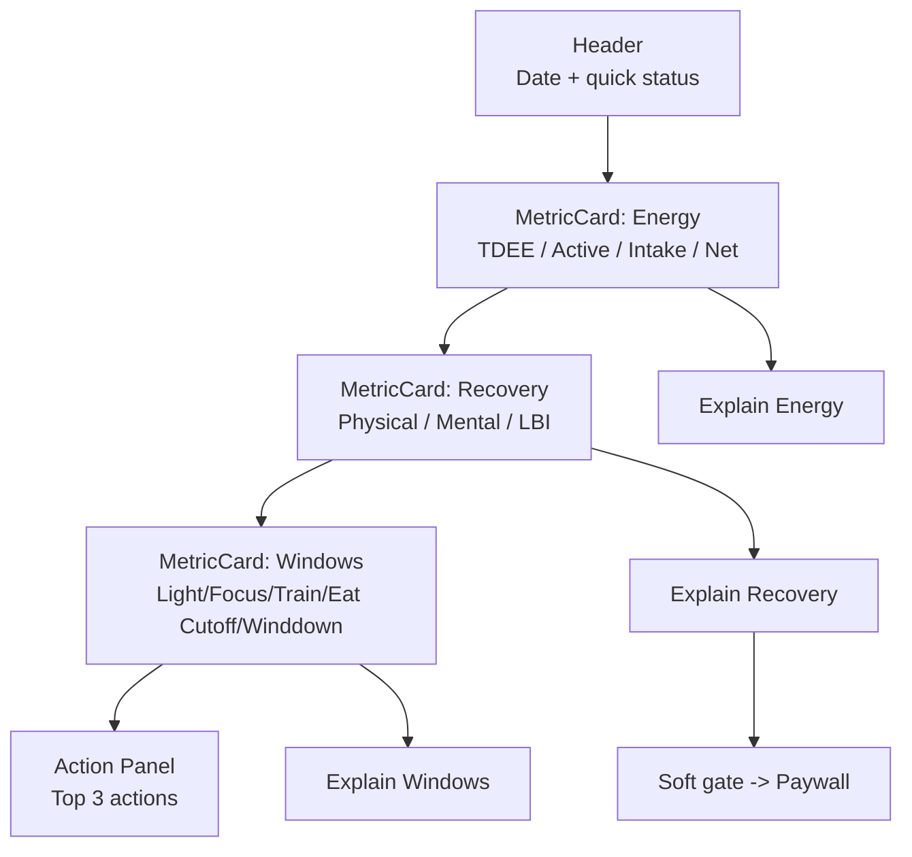

# 02-Today 页线框

更新时间：2026-01-30

```mermaid
flowchart TD
  A[Header\nDate + quick status] --> B[MetricCard: Energy\nTDEE / Active / Intake / Net]
  B --> C[MetricCard: Recovery\nPhysical / Mental / LBI]
  C --> D[MetricCard: Windows\nLight/Focus/Train/Eat Cutoff/Winddown]
  D --> E[Action Panel\nTop 3 actions]
  B --> X[Explain Energy]
  C --> Y[Explain Recovery]
  D --> Z[Explain Windows]
  Y --> P[Soft gate -> Paywall]
```

## 交互说明
- 三张卡都可点入 Explain（解释层），解释层最多 3 屏，避免长文
- Action Panel 每条建议都有“为什么”和“一键执行”（如打开相机记录、开始轻运动）
