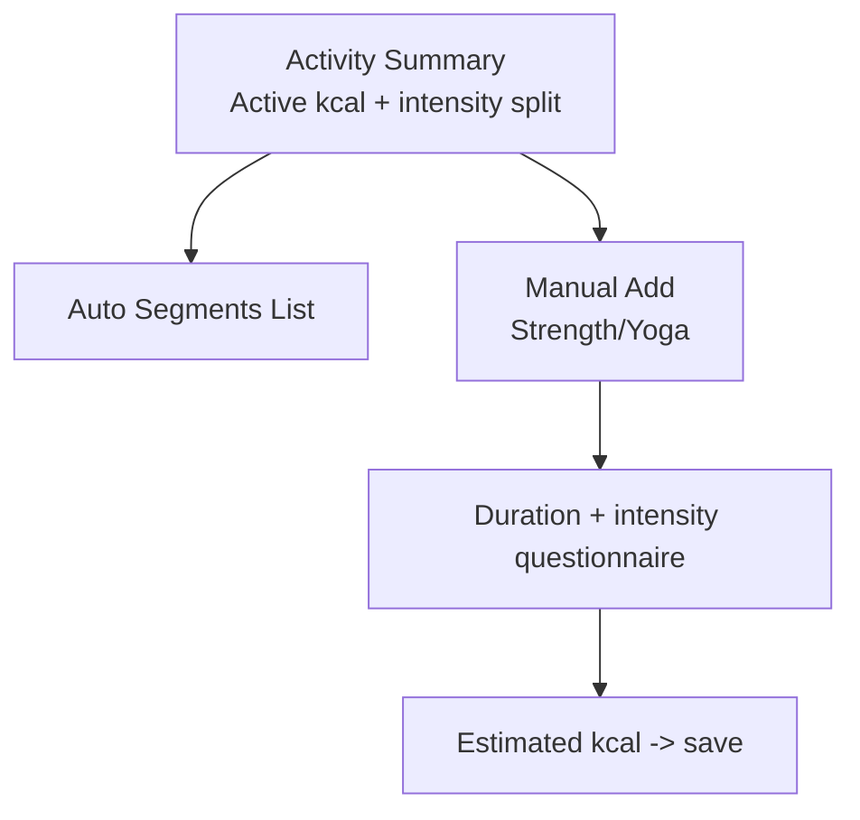

# 04-Activity 页线框

更新时间：2026-01-30

## 结构
- 今日活动消耗（Active kcal）
- 自动识别 segments 列表（walk/run/bike/vehicle/still）
- 手动记录：Strength / Yoga（时长 + 强度问卷）

```mermaid
flowchart TD
  A[Activity Summary\nActive kcal + intensity split] --> B[Auto Segments List]
  A --> C[Manual Add\nStrength/Yoga]
  C --> D[Duration + intensity questionnaire]
  D --> E[Estimated kcal -> save]
```
