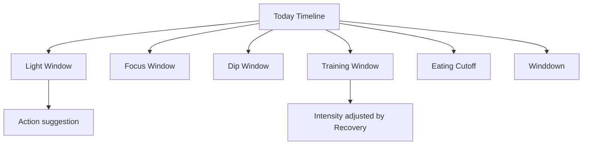

# 06-Timing 窗口页线框

更新时间：2026-01-30

## 页面目的
把“节律”变成可执行的日程窗口，避免抽象。

```mermaid
flowchart TD
  A[Today Timeline] --> B[Light Window]
  A --> C[Focus Window]
  A --> D[Dip Window]
  A --> E[Training Window]
  A --> F[Eating Cutoff]
  A --> G[Winddown]
  B --> H[Action suggestion]
  E --> I[Intensity adjusted by Recovery]
```
