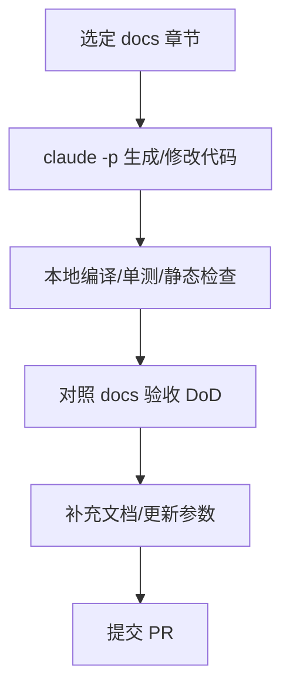

# 03-ClaudeCLI开发工作流

更新时间：2026-01-30

```mermaid
flowchart TD
  A[选定 docs 章节] --> B[claude -p 生成/修改代码]
  B --> C[本地编译/单测/静态检查]
  C --> D[对照 docs 验收 DoD]
  D --> E[补充文档/更新参数]
  E --> F[提交 PR]
```

## 提示词模板（强制包含）
- 引用：docs/xx-.../yy.md
- 目标文件路径：ios/... 或 backend/...
- 输出要求：可编译、最小闭环、不要仅片段
