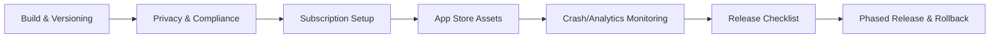

# 上线准备总览（App Store / 合规 / 订阅 / 运营）— MVP v1

更新时间：2026-01-29  
目标：把“能跑的 MVP”变成“能过审、能收钱、能监控、能迭代”的版本。

---

## 1. 上线清单总流程

---

## 2. MVP 必做项（强制）
- App Store Connect：
  - App 信息、版本、截图、关键词、隐私政策链接
  - IAP 订阅 SKU（StoreKit2）与沙盒测试账号
- 隐私与合规：
  - **非医疗声明（Non-medical disclaimer）**
  - HealthKit 相关声明与用途说明
  - 数据收集披露（Privacy Nutrition Labels）
- 技术准备：
  - 崩溃上报（至少一种：Sentry/Firebase Crashlytics）
  - 埋点可查询（最小：events 表 + 基本 SQL）
- 运营准备：
  - Welcome 文案、Paywall 文案、FAQ（最少 5 条）
  - 客服邮箱 + 自动回复模板（可选）

---

## 3. 版本策略（推荐）
- 版本号：`1.0.0`（marketing）+ build `100`
- 分支：
  - `release/*`：冻结修 bug
  - `hotfix/*`：紧急修复
- 提交门槛：
  - iOS：能启动 + Today/Paywall 核链路走通
  - backend：migrations 可从空库重建 + health check ok

---
