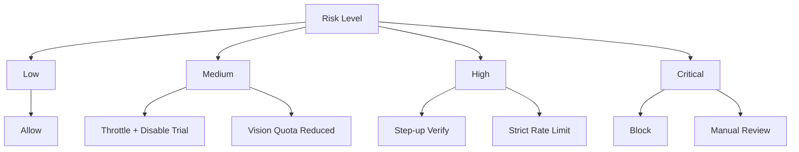

# 风险评分（Risk Score）与策略矩阵（Policies）

更新时间：2026-01-30  
说明：MVP 不需要复杂 ML。先用规则 + 分值累加即可，后续再进化为模型。

---

## 1. 风险评分（0–100）
- 0–29：low（正常）
- 30–59：medium（降级/限频）
- 60–79：high（二次验证/强限频）
- 80–100：critical（封禁/强拦）

---

## 2. 规则示例（可直接落地）
| rule_id | 条件 | 分值 |
|---|---|---:|
| R1 | 同 device 24h 内注册 ≥ 3 | +30 |
| R2 | 10 分钟内 vision 请求 ≥ 6 | +25 |
| R3 | 1 小时内 vision 失败率 ≥ 80% 且次数 ≥ 10 | +20 |
| R4 | premium API 403（entitlement 无效）但客户端持续重试 ≥ 5 | +20 |
| R5 | jailbreak/debugger signal = true | +10 |
| R6 | 同 ip_hash 10 分钟内账号 ≥ 5 | +15 |
| R7 | 登录失败 ≥ 10 / 10min | +20 |

可衰减：
- 每 24h 风险分 *0.7（无新异常时）
参数：
- `risk.decay.daily_factor = 0.7`

---

## 3. 处置策略矩阵（Policy → Action）

---

## 4. “降级”应该怎么做（体验友好）
- vision：从“照片识别”降级为“条码/搜索”
- premium：Explain gate → 仅保留基础分数
- timing：仅保留窗口标题，不给细建议（减少被爬取价值）
- analytics：对可疑流量采样率降低（防刷埋点）

---

## 5. “二次验证”建议（High 才触发）
- 邮箱验证（如果用了 email 登录）
- 强制重新登录（refresh token 失效）
- App Attest challenge（Level1）
- 购买相关：强制 refresh entitlement

---

## 6. “封禁”需要申诉路径
- Settings/Support：Contact support
- 后端：ban_reason + expires_at
- 解封：必须记录审计

---
