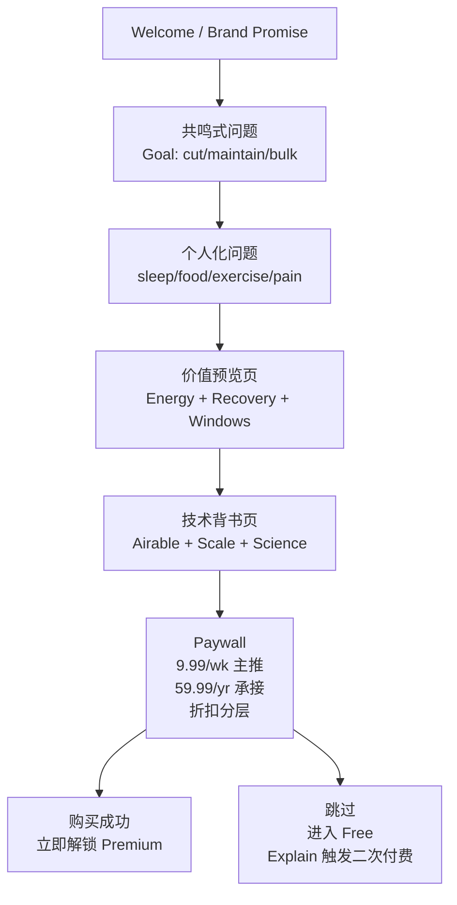

# 商业化与定价总览（Onboarding → Value → Paywall → Retention）— MVP v1+

更新时间：2026-01-30  
目标：在不牺牲品牌高级感（Oura 风）与长期留存的前提下，实现：
- 新用户共鸣 → “我需要它”
- 价值证明 → “它能帮到我”
- 技术背书 → “我信它”
- Paywall 转化 → “我愿意付费”
- 付费后价值交付 → “我觉得值、愿意续订”

---

## 1. 核心商业策略（一句话）
**用“个人生物节律（睡眠恢复 + 行为窗口）”把热量系统从“记账”升级为“指导”，用恢复分决定训练与进食策略，让减脂/增肌更科学、更轻松。**

---

## 2. 价格与分层（你定义的 SKU）
主推：
- Weekly：$9.99 / week 自动续订（主力）
承接：
- Yearly：$59.99 / year（Best value 承接）

分层折扣（用于二次触达/留存挽回/渠道策略）：
- 50% OFF：$4.99 / week
- 80% OFF：$1.99 / week

> 重要：折扣不是“所有人都看到”。必须结合 docs/12 远程配置 + docs/14 风控，做灰度与反薅羊毛。

---

## 3. 商业路径（主漏斗）

---

## 4. 关键原则（强制）
- **Paywall 不是功能表**：卖“结果”（更稳食欲、更稳执行、更稳体重曲线）
- **先个性化再报价**：问卷 → 生成 1 句承诺 → 再进入 paywall
- **弱门优先（soft gate）**：先让用户体验“Today”，在 Explain/Plan 处触发二次付费
- **服务端权威**：Premium 权益由 entitlement 决定（见 docs/13）
- **可调参**：offer/折扣/触发条件都必须可远程配置（见 docs/12）

---
