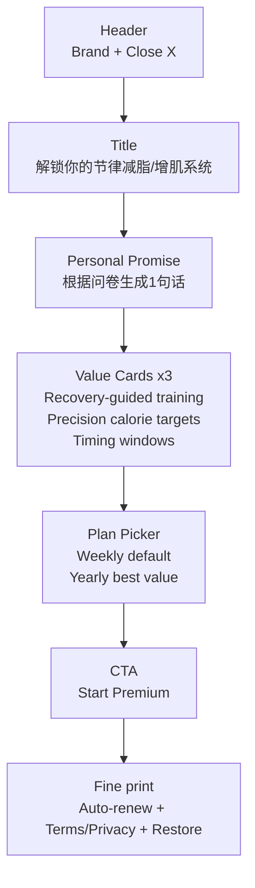

# Paywall 结构与文案（Oura 风）— Weekly 主推 + Yearly 承接 + 折扣分层

更新时间：2026-01-30

---

## 1. 信息架构（强制）

---

## 2. 文案模板（可直接用）
标题：
- “Unlock your rhythm-based plan”
- 中文：解锁你的节律减脂/增肌系统

副标题（个性化承诺）：
- 从 `personal_promise_key` 渲染

价值卡（固定三张）：
1) **Recovery-guided training**
   - “Train harder only when your body is ready.”
2) **Precision calorie targets**
   - “Daily intake + activity targets, automatically.”
3) **Timing windows**
   - “Light, meals, training — aligned to your body clock.”

---

## 3. 定价区（Plan Picker）
默认展示两项（避免选择瘫痪）：
- Weekly — $9.99 / week（默认选中，Most flexible）
- Yearly — $59.99 / year（Best value • Save XX%）

年卡“承接”策略：
- 在 yearly 右上角加 badge：Best value
- 下方写：Equivalent $X/week（折算）

---

## 4. 折扣分层（Offer Tiering）
你定义的两档折扣：
- 50% OFF：$4.99/week
- 80% OFF：$1.99/week

推荐展示方式（不要同时三档并列）：
- 默认 A offer（9.99/wk + 59.99/yr）
- 用户犹豫/退出触发“限时 offer”弹层：
  - B：4.99/wk（50% off，划线 9.99）
  - C：1.99/wk（80% off，仅高流失风险用户）

---

## 5. 触发策略（与 docs/12 + docs/14 对齐）
- B offer（4.99）触发：
  - paywall 停留 ≥ 8s 且未点击 CTA
  - 或点击 “Not now”
- C offer（1.99）触发：
  - 过去 7 天 paywall_view ≥ 2 且未购买
  - 且 risk_level != medium/high/critical（防薅羊毛）
  - 且渠道允许（ROI 策略）

---

## 6. 合规必备（必须展示）
- 自动续订说明
- 管理/取消路径
- Terms / Privacy
- Restore Purchases

---
