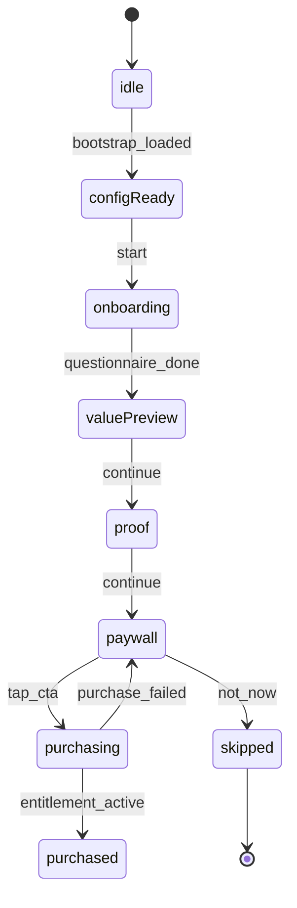

# iOS 页面栈、路由与状态机（商业化）

更新时间：2026-01-30

## 1. 页面栈（推荐）
- WelcomeView
- OnboardingQuestionnaireView（6–8 题）
- ValuePreviewView（Energy/Recovery/Windows）
- TechProofView（Airable/Scale/Science）
- PaywallView（PlanPicker + CTA + FinePrint）
- PurchaseProcessingSheet（loading/error）
- PurchaseSuccessView
- EnterToday（Free）

## 2. UI Flow（含软门与二次付费）
```mermaid
flowchart TD
  A[Welcome] --> B[Questionnaire]
  B --> C[ValuePreview]
  C --> D[TechProof]
  D --> E[Paywall]
  E -->|buy success| F[Success]
  E -->|skip| G[Enter Today (Free)]
  G --> H[Explain/Plan Gate]
  H --> E
```

## 3. 状态机（可直接编码）
状态：
- idle → configReady → onboarding → valuePreview → proof → paywall
- paywall → purchasing → purchased（entitlement_active）
- paywall → skipped（进入 free）
- any → error



## 4. 关键模块（建议 Swift 结构）
- PaywallCoordinator：负责 flow 路由/状态机
- PaywallViewModel：offer 决策、plan 选择、埋点
- PurchaseManager：StoreKit2 purchase/restore/updates
- EntitlementStore：缓存 entitlement（TTL + 强刷新点）
- RemoteConfigStore：bootstrap 缓存（docs/12）
- RiskStore：拉取 /risk/state（docs/14）

## 5. 软门（体验关键）
- Onboarding 完毕后允许进入 Today（Free）
- Premium 价值点以 Explain Gate 触发（二次付费）：
  - 查看“为什么今天要这样吃/这样练？”→ paywall
  - 查看“趋势/个性化窗口解释”→ paywall

## 6. kill switch 行为（必须）
- kill_switch.all=true：进入维护页
- kill_switch.payments=true：隐藏购买入口，仅保留 restore
- feature.paywall.enabled=false：全局关闭商业化（free 模式）
