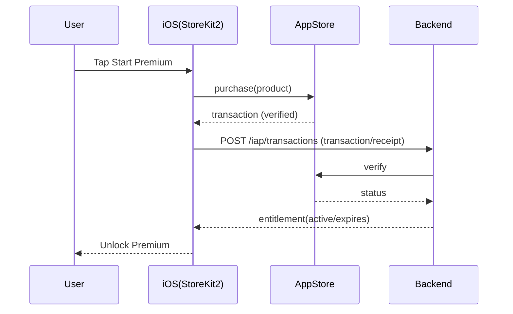

# StoreKit2 购买链路（iOS 15.6+）与后端上报

更新时间：2026-01-30  
目标：购买成功后以服务端 entitlement 为准解锁（防破解）。

## 1) 购买时序（强制）

## 2) iOS 必做（MVP）
- 只接受 verified transaction
- 购买后立刻 POST /iap/transactions
- 购买后强制 GET /entitlement 刷新 UI
- 监听 Transaction.updates（续订/状态变化）
- Restore：同步交易→上报→拉 entitlement

## 3) Entitlement 缓存与强刷新
- TTL：24h（paywall.entitlement.cache_ttl_sec）
- 强刷新点：
  - App cold start
  - paywall_view
  - purchase_success / restore_success
  - premium API 403（先 refresh 再提示）

## 4) 常见失败与 UX
- userCancelled：不弹错误，回到 paywall
- network：提示可重试
- backend verify error：提示“验证失败”并自动重试一次
